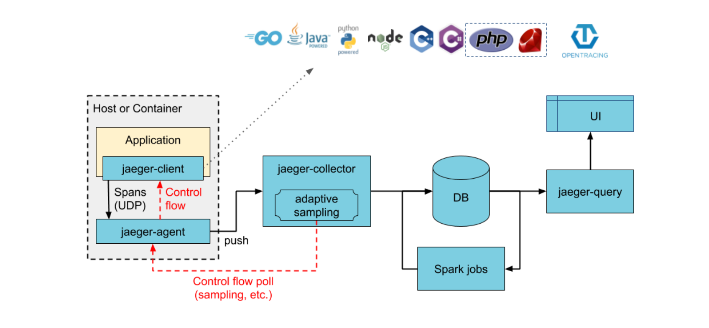
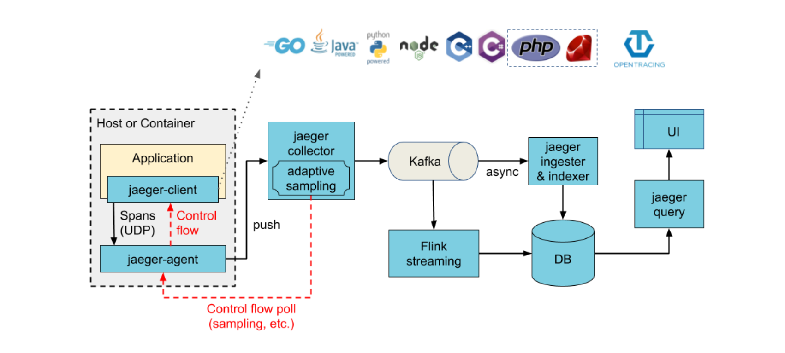
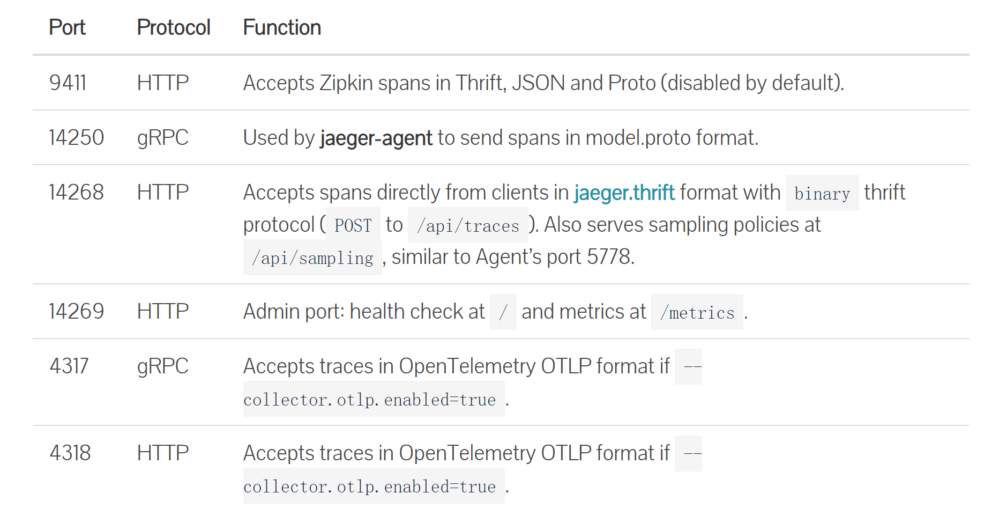
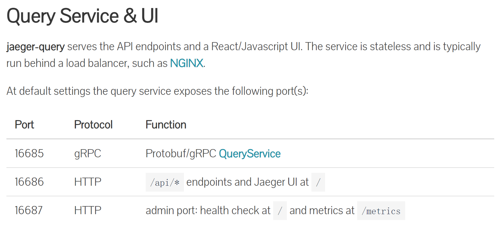
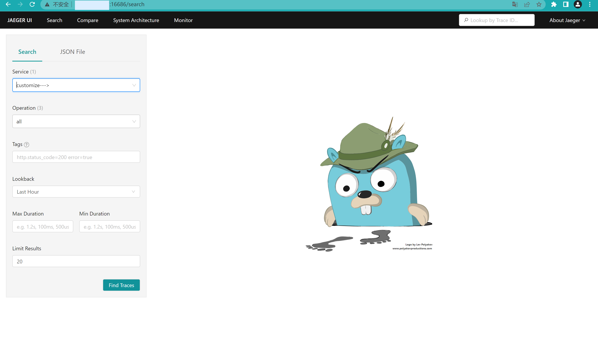
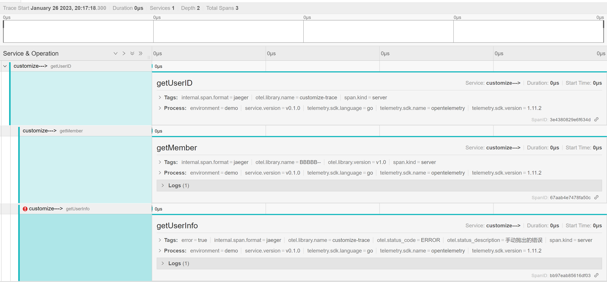
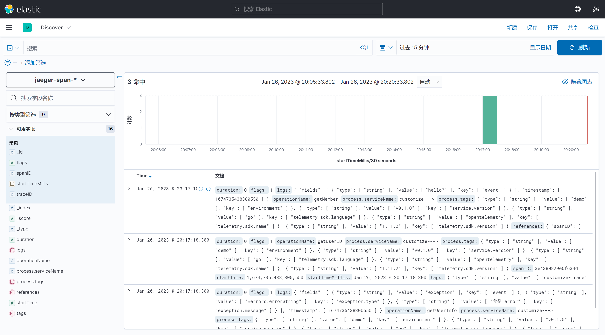

# Docker下Jaeger部署文档	


近来在学习到Jaeger链路追踪的时候，顺带学习了一下如何去部署Jaeger在服务器上


## 关于Jaeger

Jaeger 受到[Dapper](https://research.google.com/pubs/pub36356.html)和[OpenZipkin的启发，是由](http://zipkin.io/)[Uber Technologies](http://uber.github.io/)作为开源发布的分布式跟踪系统。它用于监控和故障排除基于微服务的分布式系统，包括：

- 分布式上下文传播
- 分布式事务监控
- 根本原因分析
- 服务依赖分析
- 性能/延迟优化


## 技术规格

- Go 中实现的后端组件
- React/Javascript 用户界面
- 支持的存储后端：
  - [Cassandra 3.4+](https://www.jaegertracing.io/docs/1.41/deployment/#cassandra)
  - [Elasticsearch 5.x, 6.x, 7.x](https://www.jaegertracing.io/docs/1.41/deployment/#elasticsearch)
  - [Kafka](https://www.jaegertracing.io/docs/1.41/deployment/#kafka)
  - 内存存储
  - 经过认证的 grpc 插件：
    - [带有 Promscale 的 PostgreSQL](https://www.jaegertracing.io/docs/1.41/deployment/#remote-storage-model)
    - [ClickHouse](https://www.jaegertracing.io/docs/1.41/deployment/#sidecar-model)


## 先来看一下Jaeger的架构





> 你可以使用Kafka收集JaegerCollector的数据 经过flink处理
>
> 这里我使用的是 Jaeger-Collector + Jaeger-Query + Elasticsearch + kibana进行收集


## 看一下Jaeger-Collector + Jaeger-Query的定义


### Collector

Jaeger**收集器**从 SDK 或 Jaeger[代理](https://www.jaegertracing.io/docs/1.41/architecture#agent)接收跟踪，通过处理管道运行它们以进行验证和清理/丰富，并将它们存储在存储后端中。

Jaeger 内置了对多个存储后端的支持（请参阅[部署](https://www.jaegertracing.io/docs/1.41/deployment)），以及用于实现自定义存储插件的可扩展插件框架。


### Query

Jaeger**查询**是一种服务，它公开用于从存储中检索跟踪的[API](https://www.jaegertracing.io/docs/1.41/apis)，并托管用于搜索和分析跟踪的 Web UI。


## 开始部署


### 1.下载对应的docker镜像 

这里通过dockerhub可以搜索到对应的镜像了

`下载jaeger对应镜像`

```dockerfile
#collector镜像
docker pull jaegertracing/jaeger-collector:latest
#query镜像
docker pull jaegertracing/jaeger-query:latest
```

`下载es+kibana对应镜像`

```dockerfile
#注意：这里我使用的是7.12.0版本 最好是使用7版本的es
docker search elasticsearch:7.12.0
docker pull kibana:7.12.0
```

我是通过查阅官方文档选择的7版本

> 自 0.6.0 起支持 Jaeger 支持的版本：5.x、6.x、7.x
>
> Elasticsearch 版本自动从 root/ping 端点检索。基于此版本，Jaeger 使用兼容的索引映射和 Elasticsearch REST API。可以通过`--es.version=`标志显式提供版本。
>
> [除了安装和运行 Elasticsearch](https://www.elastic.co/downloads/elasticsearch)之外，Elasticsearch不需要初始化 。一旦运行，将正确的配置值传递给 Jaeger 收集器和查询服务。


### 2.启动对应的镜像

```shell
#1.创建一个docker网络
docker network create es-kibana
#2.启动es和kibana容器
#这里就不过多赘述 将es容器和kibana容器启动在同一个dokcer网络中即可

#3.启动Jaeger-Collector容器 随后我们讲暴露端口的作用
docker run -d --name jaeger-collector -p 14268:14268 -p 14269:14269 -e SPAN_STORAGE_TYPE=elasticsearch -e ES_SERVER_URLS=http://你自己的ip:9200 jaegertracing/jaeger-collector:latest

#4.启动Jaeger-Query容器 随后我们讲暴露端口的作用
docker run -d --name jaeger-query -p 16686:16686 -p 16687:16687 -e SPAN_STORAGE_TYPE=elasticsearch -e ES_SERVER_URLS=http://你自己的ip:9200 jaegertracing/jaeger-query:latest
```

> :star:**先启动es 再启动Jaeger的两个容器**


#### 2.1 Collector暴露的端口



> 这里摘自Jaeger的官方文档，有兴趣自己可以去研究一下[Jaeger部署-collector](https://www.jaegertracing.io/docs/1.41/deployment/#collector)

大概意思就是`14268`端口是用于接受外部client的数据，`14269`是用于监控健康指标的。


#### 2.2 Query暴露的端口



> 这里同样摘自Jaeger官网，感兴趣的可以去研究一下[Jaeger部署-query](https://www.jaegertracing.io/docs/1.41/deployment/#query-service--ui)

大概意思就是`16686`端口是用于WebUI的，`16687`是用于监控健康指标的。


### 3.测试最终效果

#### 	3.1 准备测试文件

```go
// 注意！这里仅是测试的一个函数 并不包括完全的过程，仅用于测试部署，不涉及链路追踪知识
func{
    // 父span
    newCtx, span := otel.Tracer(traceName).Start(ctx, "getUserID", trace.WithSpanKind(trace.SpanKindServer))
    defer span.End()

    fx.Parallel(
        func() {
            //子span一
            _, span := otel.Tracer(traceName).Start(newCtx, "getUserInfo", trace.WithSpanKind(trace.SpanKindServer))
            span.End()
        }, func() {
            //子span二
            _, span := otel.Tracer(traceName).Start(newCtx, "getMember", trace.WithSpanKind(trace.SpanKindServer))
            span.End()
        })
}
```

​	

#### 	3.2查看效果

打开浏览器，在地址栏上输入`服务器ip:16686`访问

> 记得确保自己防火墙有开放端口！






我们继续点开kibana查看数据是否发往es存储

浏览器输入`你自己的ip:5601`



这是就可以看到数据成功发往es了